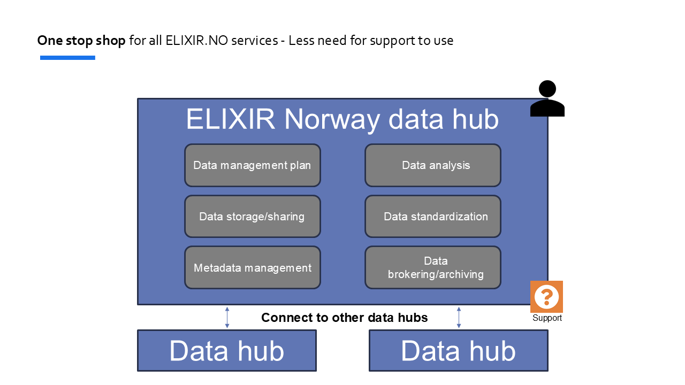

# Datahub Ecosystem
This repository includes core applications of the ecosystem and exemplifies a typical frontend/backend extension that integrates with the core services.

## Getting started
- make sure the following ports are not currently being used
  - 80  (for nginx)
  - 8080 (for keycloak)
  - 8001 (for app registry)
  - 8000 (for example api using FastAPI)
  - 4200 (for example frontend using Angular)
- install docker and docker compose with the right permissions
- docker compose up --build
- open browser at : http://localhost

## Components
- IAM (Identity and Access Management)
  - [keycloak](https://www.keycloak.org/) is used for this
  - docker compose provides an initial REALM json file for import
    - two sample clients
    - one test user 
- Reverse proxy
  - uses nginx with default configs
- App Registry
  - a python FastAPI application that provides front-ends and apis registered in the eco-system
  - it's currently only supports returning a fixed list
  - TODO:
    - initialize from json file for static , intit time listing or
    - provide a restful API
    - protect endpoints with keycloak (ref fastapi example)
- Backend FastAPI
  - example API using [FastAPI](https://fastapi.tiangolo.com/) python framework
  - hooked with the Keycloak
  - exposes example public and protected endpoints
- Frontend Angular
  - example frontend using [Angular](https://angular.dev/)
  - integrates with Keycloak login
  - invokes public and protected end-points from the example backend
